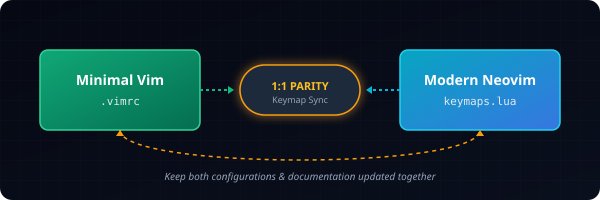

# Contributing to Vim Stack

First off, thank you for considering contributing to **Vim Stack**! This project aims to maintain high parity between a minimal Vim configuration and an advanced Neovim environment so developers never lose their muscle memory.

<p align="center">
  
</p>

---

## 📜 The Keymap Sync Contract

The most important rule in this repository is the **1:1 Keymap Parity Rule**:

> [!IMPORTANT]
> If you add, modify, or delete a keybinding in one configuration, you **must** apply the corresponding change to the other configuration and update all documentation tables.

* If you add a keybinding in Vim's **[.vimrc](file:///home/ngoducvuong/Documents/Projects/dotfiles-linux/vim-stack/vim-editor/.vimrc)**, implement the equivalent feature or mapping in Neovim's **[keymaps.lua](file:///home/ngoducvuong/Documents/Projects/dotfiles-linux/vim-stack/lazyvim/lua/config/keymaps.lua)**.
* If you upgrade a Neovim binding (e.g. mapping to a plugin like `Snacks.picker` instead of raw Vim command), keep the **same trigger key** (e.g., `<leader>p`).
* Update the keymap tables in three places:
  1. The root **[README.md](file:///home/ngoducvuong/Documents/Projects/dotfiles-linux/vim-stack/README.md)**
  2. The Vim configuration **[vim-editor/README.md](file:///home/ngoducvuong/Documents/Projects/dotfiles-linux/vim-stack/vim-editor/README.md)**
  3. The Neovim configuration **[lazyvim/README.md](file:///home/ngoducvuong/Documents/Projects/dotfiles-linux/vim-stack/lazyvim/README.md)**

---

## 📂 Configuration Architecture

### Minimal Vim (`vim-editor`)
Keep this configuration lightweight and self-contained:
* Avoid plugin managers or external packages.
* Use Vim script features only.
* Ensure configurations are compatible with standard stock Vim.
* Read the **[vim-editor/README.md](file:///home/ngoducvuong/Documents/Projects/dotfiles-linux/vim-stack/vim-editor/README.md)** for details on hand-rolled comment functions or auto-pairing logic.

### Modern Neovim (`lazyvim`)
This editor configuration is built on the **LazyVim** framework. Code is structured as follows:
* **[lua/config/options.lua](file:///home/ngoducvuong/Documents/Projects/dotfiles-linux/vim-stack/lazyvim/lua/config/options.lua)**: Vim settings and options (tab stops, line numbers, clipboard settings).
* **[lua/config/keymaps.lua](file:///home/ngoducvuong/Documents/Projects/dotfiles-linux/vim-stack/lazyvim/lua/config/keymaps.lua)**: Standard keymaps and synced sequences.
* **[lua/config/autocmds.lua](file:///home/ngoducvuong/Documents/Projects/dotfiles-linux/vim-stack/lazyvim/lua/config/autocmds.lua)**: Event listener hooks (e.g. reload-on-change, restoring cursor position).
* **[lua/plugins/](file:///home/ngoducvuong/Documents/Projects/dotfiles-linux/vim-stack/lazyvim/lua/plugins/)**: Submodules to configure and install plugins. Keep this lean and avoid duplicate plugins (e.g. we use `blink.cmp` instead of `nvim-cmp`, and `Snacks.terminal` instead of `toggleterm`).

---

## 🛠️ How to Test Changes

### Testing Vim Editor
1. Make changes to `vim-editor/.vimrc`.
2. Test it locally by sourcing that specific file:
   ```bash
   vim -u vim-editor/.vimrc
   ```
3. Verify that the new functionality operates smoothly and doesn't trigger start-up errors.

### Testing LazyVim Neovim
1. Make changes in `lazyvim/lua/config/` or `lazyvim/lua/plugins/`.
2. Backup your existing `nvim` configuration if necessary and symlink to `lazyvim/`:
   ```bash
   ln -sf "$(pwd)/lazyvim" ~/.config/nvim
   ```
3. Run Neovim to verify the plugins load correctly:
   ```bash
   nvim
   ```
4. Verify the changes using the `:Lazy` dashboard and test the synced keybindings.

---

## 🧹 Code Quality Standards

* **Keep Comments Clean**: Maintain explanatory comments for all custom maps.
* **Format Lua Code**: Neovim configurations must be formatted. If you edit `.lua` files, format them using `stylua` or let `conform.nvim` format them on save before committing.
* **No Unused Code**: Avoid dead imports or duplicate plugins. Clean up speculative configurations.
