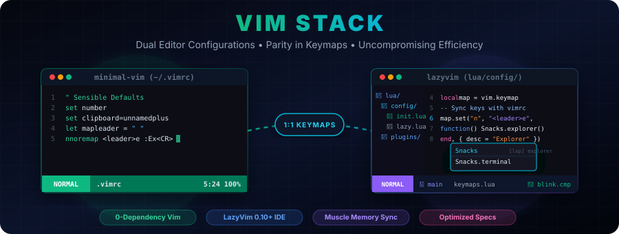

# <p align="center">⚡ Vim Stack</p>

<p align="center">
  
</p>

<p align="center">
  <strong>Dual terminal text editor configurations sharing a unified muscle memory.</strong>
</p>

---

**Vim Stack** is a curated collection of dual configurations designed to optimize terminal text editing. It consists of a dependency-free **Minimal Vim** setup and a feature-rich, modern **Neovim (LazyVim)** environment. Both configurations are carefully synchronized so that the exact same keybindings trigger equivalent functionalities.

This dual setup allows you to switch seamlessly between:
1. **Remote Servers, SSH Sessions & Containers**: Using the lightweight, zero-plugin Vim config (`vim-editor`) which boots instantly and requires no setup.
2. **Local Machine & Heavy Development Work**: Using the modern Neovim IDE configuration (`lazyvim`) equipped with LSPs, autocomplete, Treesitter parser highlighting, and robust plugins.

---

## 📂 Repository Structure

The project is split into two specialized workspaces:

* **[vim-editor/](file:///home/ngoducvuong/Documents/Projects/dotfiles-linux/vim-stack/vim-editor/)**: Contains the classic Vim setup.
  * **[.vimrc](file:///home/ngoducvuong/Documents/Projects/dotfiles-linux/vim-stack/vim-editor/.vimrc)**: A single-file, dependency-free configuration using only stock Vim features.
  * **[vim-editor/README.md](file:///home/ngoducvuong/Documents/Projects/dotfiles-linux/vim-stack/vim-editor/README.md)**: Feature list and installation details for minimal Vim.
* **[lazyvim/](file:///home/ngoducvuong/Documents/Projects/dotfiles-linux/vim-stack/lazyvim/)**: Contains the advanced Neovim setup.
  * **[lazyvim/init.lua](file:///home/ngoducvuong/Documents/Projects/dotfiles-linux/vim-stack/lazyvim/init.lua)**: Entry point for the LazyVim-based setup.
  * **[lazyvim/lua/config/keymaps.lua](file:///home/ngoducvuong/Documents/Projects/dotfiles-linux/vim-stack/lazyvim/lua/config/keymaps.lua)**: The synced custom keybindings mirroring the `.vimrc` settings.
  * **[lazyvim/lua/config/options.lua](file:///home/ngoducvuong/Documents/Projects/dotfiles-linux/vim-stack/lazyvim/lua/config/options.lua)**: Sensible options, including clipboard sync and indentation guides.
  * **[lazyvim/install-deps.sh](file:///home/ngoducvuong/Documents/Projects/dotfiles-linux/vim-stack/lazyvim/install-deps.sh)**: A comprehensive bash script to install all needed binaries (LSPs, compilers, formatting runtimes).
  * **[lazyvim/README.md](file:///home/ngoducvuong/Documents/Projects/dotfiles-linux/vim-stack/lazyvim/README.md)**: Deep dive into the Neovim plugins, structure, and optimization details.
* **[assets/](file:///home/ngoducvuong/Documents/Projects/dotfiles-linux/vim-stack/assets/)**: Stores design assets, including the custom banner SVG.
  * **[assets/banner.svg](file:///home/ngoducvuong/Documents/Projects/dotfiles-linux/vim-stack/assets/banner.svg)**: Vector illustration comparing both configurations.

---

## 🔄 Keyboard & Behavior Parity

The core philosophy of **Vim Stack** is that **the same key combinations should do the same thing** across both editors. Whenever possible, Neovim upgrades the experience with plugins while retaining the exact same physical keys.

The leader key is set to **`Space`** in both editors.

| Key combination | Mode | Minimal Vim (`vim-editor`) | Neovim (`lazyvim`) | Behavior Description |
| :--- | :---: | :--- | :--- | :--- |
| **`Space + e`** | Normal | `:Ex` (built-in `netrw`) | `Snacks.explorer()` | Toggles the sidebar file tree explorer |
| **`Space + p`** | Normal | `:find` + recursive tab completion | `Snacks.picker.files()` | Opens a fuzzy file finder / picker |
| **`Space + t`** | Normal | `:tabnew` | `:tabnew` | Opens a new empty tab page |
| **`Space + q`** | Normal | `:q` | `:q` | Closes the current window pane or split |
| **`Space + \|`** | Normal | `:vsplit` | `:vsplit` | Creates a vertical window split (side-by-side) |
| **`Space + -`** | Normal | `:split` | `:split` | Creates a horizontal window split (stacked) |
| **`Ctrl + i`** | Normal | `:bnext` | `:bnext` | Switches to the next open buffer/file |
| **`Ctrl + o`** | Normal | `:bprevious` | `:bprevious` | Switches to the previous open buffer/file |
| **`Shift + H`** | Normal | `:tabprevious` | `:tabprevious` | Switches to the previous tab |
| **`Shift + L`** | Normal | `:tabnext` | `:tabnext` | Switches to the next tab |
| **`Ctrl + \``** | Normal/Term | *Not bound* | `Snacks.terminal()` (bottom) | Toggles the integrated terminal panel |
| **`Space + s + h`** | Normal | `:terminal` (horizontal split) | *Not bound* | Opens a horizontal terminal split |
| **`Space + s + v`** | Normal | `:terminal` (vertical split) | *Not bound* | Opens a vertical terminal split |
| **`Esc + Esc`** | Terminal | Switch to Terminal Normal Mode | Switch to Terminal Normal Mode | Escapes insert mode inside the terminal buffer |
| **`Ctrl + /`** (or `Space + /`) | Normal/Visual | Custom `ToggleComment` function | Native `gc` / `gcc` commenting | Toggles comment lines using correct language syntax |
| **`Space + r + c`** | Normal | Open `$MYVIMRC` in vsplit | Open `init.lua` in vsplit | Quickly opens the config file for editing |
| **`Space + r + o`** | Normal | Open `$MYVIMRC` in new tab | Open config directory in tab | Opens the configuration folder in a new tab |
| **`Space + r + s`** | Normal | `:source $MYVIMRC` | Reloads options & keymaps | Reloads configuration changes on the fly |
| **`(` `[` `{` `"` `'`** | Insert | Custom mapping script | `mini.pairs` plugin | Auto-closes brackets/quotes and manages smart deletions |
| **`%`** | Normal | `matchit` (HTML tags, code blocks) | `matchit` (HTML tags, code blocks) | Jumps between matching tags, brackets, or code pairs |

---

## ⚙️ Shared Sensible Defaults

In addition to keymaps, both configurations establish consistent behaviors:
* **System Clipboard Integration**: Copy, cut, and paste actions automatically synchronize with the system clipboard (`clipboard=unnamedplus`), with Wayland fallback detection in Neovim.
* **Smart Tab Indentation**: Sensible 4-space width, expanding tabs to spaces, with smart/auto alignment.
* **Case-Sensitive Searching**: Searches are case-insensitive by default but automatically switch to case-sensitive if you include uppercase letters. Highlights matches incrementally as you type.
* **File Reloading & Cursor Recovery**: Files modified outside the editor automatically reload. Reopening a file jumps you back to your last cursor position.
* **Invisible Character Display**: Shows subtle indicator guides for trailing whitespace, non-breaking spaces, and tab markers (`listchars`).

---

## 📥 Installation

### 1. Minimal Vim Configuration
To install the minimal configuration, simply copy the `.vimrc` to your home directory:
```bash
cp vim-editor/.vimrc ~/.vimrc
```
Launch Vim, and it will immediately run with the synced features and zero dependencies.

### 2. Neovim Configuration
To install the Neovim configuration, follow these steps:

1. **Backup existing config (if any)**:
   ```bash
   mv ~/.config/nvim ~/.config/nvim.bak
   mv ~/.local/share/nvim ~/.local/share/nvim.bak
   ```

2. **Copy or Symlink the directory**:
   ```bash
   ln -s "$(pwd)/lazyvim" ~/.config/nvim
   ```

3. **Install System Dependencies**:
   This configuration relies on external helpers like `ripgrep`, `fd`, `lazygit`, and language compilation toolchains. Run the provided script to install dependencies automatically:
   ```bash
   cd lazyvim
   chmod +x install-deps.sh
   ./install-deps.sh
   ```

4. **Launch Neovim**:
   ```bash
   nvim
   ```
   On first launch, LazyVim will automatically install `lazy.nvim` and all configured plugins (`snacks.nvim`, `blink.cmp`, LSPs, and treesitter parsers).

---

## 🛠️ Requirements & System Info

* **Vim**: Requires Vim compiled with `+termguicolors` (true-color themes), `+clipboard` (clipboard sync), and `+terminal` (integrated terminal).
* **Neovim**: Neovim version `0.10+` is required for out-of-the-box Treesitter-based commenting and modern picker capabilities.
* **Fonts**: A [Nerd Font](https://www.nerdfonts.com/) is highly recommended for Neovim's statusline and file tree icons.
