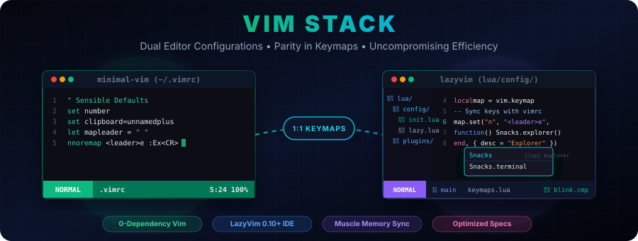

# <p align="center">⚡ Vim Stack</p>

<p align="center">
  
</p>

<p align="center">
  <strong>Dual terminal text editor configurations sharing a unified muscle memory.</strong>
</p>


---

**Vim Stack** is a curated collection of dual editor configurations designed to optimize terminal text editing. It consists of a zero-plugin **Minimal Vim** setup ([`vim-editor/`](file:///home/ngoducvuong/Documents/projects/dotfiles/vim-stack/vim-editor/)) and a feature-rich, modernized **Neovim (LazyVim)** IDE ([`nvim/`](file:///home/ngoducvuong/Documents/projects/dotfiles/vim-stack/nvim/)). Both configurations are carefully synchronized so that identical keybindings trigger equivalent actions.

This dual setup allows you to switch seamlessly between:
1. **Remote Servers, SSH Sessions & Containers**: Using the lightweight, zero-plugin Vim config (`vim-editor`) which boots instantly with pure stock Vimscript.
2. **Local Machine & Heavy Development Work**: Using the modern Neovim IDE configuration (`nvim`) equipped with Rust-backed `blink.cmp` autocompletion, Mason LSPs, Treesitter syntax highlighting, `conform.nvim` formatters, `snacks.nvim`, and Excel-style CSV data visualization.

---

## 📂 Repository Structure

The project is split into two specialized workspaces:

* **[`vim-editor/`](file:///home/ngoducvuong/Documents/projects/dotfiles/vim-stack/vim-editor/)**: Classic, zero-plugin Vim setup.
  * **[`.vimrc`](file:///home/ngoducvuong/Documents/projects/dotfiles/vim-stack/vim-editor/.vimrc)**: Single-file, zero-plugin configuration using pure Vimscript (native commenting, absolute line numbers, transparent background, persistent undo auto-dir).
  * **[`README.md`](file:///home/ngoducvuong/Documents/projects/dotfiles/vim-stack/vim-editor/README.md)**: Feature list and installation details for minimal Vim.
* **[`nvim/`](file:///home/ngoducvuong/Documents/projects/dotfiles/vim-stack/nvim/)**: Modern Neovim IDE setup (Domain-Driven architecture).
  * **[`init.lua`](file:///home/ngoducvuong/Documents/projects/dotfiles/vim-stack/nvim/init.lua)**: Standardized entry point orchestrating startup.
  * **[`lua/config/`](file:///home/ngoducvuong/Documents/projects/dotfiles/vim-stack/nvim/lua/config/)**: Core options, synchronized keymaps, and event autocmds.
  * **[`lua/plugins/`](file:///home/ngoducvuong/Documents/projects/dotfiles/vim-stack/nvim/lua/plugins/)**: 6 clean domain modules (`ui`, `editor`, `coding`, `lsp`, `formatting`, `viewers`) + `disabled.lua`.
  * **[`install-deps.sh`](file:///home/ngoducvuong/Documents/projects/dotfiles/vim-stack/nvim/install-deps.sh)**: Comprehensive bash script installing OS runtimes (`ripgrep`, `fd`, compilers, node, python).
  * **[`README.md`](file:///home/ngoducvuong/Documents/projects/dotfiles/vim-stack/nvim/README.md)**: Deep dive into the Neovim setup, viewers, and keybindings.
* **[`assets/`](file:///home/ngoducvuong/Documents/projects/dotfiles/vim-stack/assets/)**: Stores design assets, including the custom banner SVG.

---

## 🔄 Synchronized Keyboard & Behavior Parity

The leader key is set to **`Space`** in both editors.

| Key combination | Mode | Minimal Vim (`vim-editor`) | Neovim (`nvim`) | Behavior Description |
| :--- | :---: | :--- | :--- | :--- |
| **`<leader>q`** | Normal | `:q` / `:bdelete` | `Snacks.bufdelete()` | **Closes current tab/buffer ONLY** |
| **`<leader>Q`** | Normal | `:qa!` | `:confirm qa<CR>` | Quits editor completely |
| **`H` / `L`** | Normal | `:bprevious` / `:bnext` | `bprevious` / `bnext` | Switches to Previous / Next Tab |
| **`Alt + 1..9`** | Normal | Jump to Buffer 1..9 | `bufferline.go_to(1..9)` | Jumps directly to Tab 1 through 9 |
| **`<leader>e`** | Normal | `:Lexplore` (netrw) | `Snacks.explorer()` | Toggles the sidebar file explorer |
| **`Ctrl + P` / `<leader>ff`** | Normal | *Via terminal / :find* | `Snacks.picker.files()` | Opens fuzzy file finder |
| **`Ctrl + F` / `<leader>fg`** | Normal | *Via terminal / grep* | `Snacks.picker.grep()` | Searches text in project (Live Grep) |
| **`<leader>sr`** | Normal | *Via substitute* | `grug-far.open()` | Global workspace search & replace UI |
| **`<leader>\|`** | Normal | `:vsplit` | `:vsplit` | Creates vertical split (side-by-side) |
| **`<leader>-`** | Normal | `:split` | `:split` | Creates horizontal split (stacked) |
| **`Ctrl + h/j/k/l`** | Normal | `<C-w>h/j/k/l` | `<C-w>h/j/k/l` | Navigate between split windows |
| **`Alt + j` / `Alt + k`** | Normal/Visual | Move line(s) down / up | Move line(s) down / up | Move selected lines up or down |
| **`gcc` / `gc`** | Normal/Visual | Native `ToggleCommentNative()` | Native `gc` / `gcc` (Treesitter) | Toggles comments with language syntax |
| **`<leader>cf`** | Normal | `gg=G` | `conform.format()` | Format current document |
| **`<leader>cv`** | Normal | *Not bound* | `csvview.toggle()` | Toggle CSV/TSV Office spreadsheet grid |
| **`<leader>cp`** | Normal | *Not bound* | Floating `less -S` | Open massive CSV in fast Pager |
| **`<leader>um`** | Normal | *Not bound* | `render-markdown.toggle()` | Toggle Markdown rounded tables & callouts |
| **`Ctrl + /`** | Normal/Term | *Not bound* | `Snacks.terminal()` | Toggles integrated floating terminal |
| **`Esc`** | Normal | `:nohlsearch` | `:nohlsearch` | Clears search highlights |

---

## ⚙️ Shared Sensible Defaults

In addition to keymaps, both configurations establish consistent behaviors:
* **Absolute Line Numbers**: Native 1-to-1 line numbers enabled (`number=true`, `relativenumber=false`) matching VS Code and system editors.
* **System Clipboard Integration**: Copy, cut, and paste actions automatically synchronize with system clipboard (`clipboard=unnamedplus`) with Wayland `wl-clipboard` support.
* **Smart Tab Indentation**: Sensible indentation width, expanding tabs to spaces, with auto/smart alignment.
* **Case-Sensitive Searching**: Searches are case-insensitive by default (`ignorecase`) but switch to case-sensitive if uppercase letters are included (`smartcase`).
* **100% Terminal Transparency**: Inherits background and opacity directly from your terminal emulator.
* **Zero Distraction**: Spell checking is disabled globally across all buffers.

---

## 📥 Installation & Deployment

### 1. Minimal Vim Configuration
To install the minimal zero-plugin configuration:
```bash
cp vim-editor/.vimrc ~/.vimrc
```
Launch Vim (`vim`), and it will run instantly with zero third-party plugin dependencies.

### 2. Neovim Configuration
To install the Neovim IDE configuration:

1. **Backup existing config (if any)**:
   ```bash
   mv ~/.config/nvim ~/.config/nvim.bak 2>/dev/null || true
   ```

2. **Symlink or Clone repository**:
   ```bash
   git clone https://github.com/vuong-ngo/vim-stack.git /tmp/vim-stack
   cp -r /tmp/vim-stack/nvim ~/.config/nvim
   ```
   *Alternatively, if managing dotfiles locally:*
   ```bash
   ln -s "$(pwd)/nvim" ~/.config/nvim
   ```

3. **Install System Dependencies**:
   Install external tools (`ripgrep`, `fd`, compilers, node, python) using the provided script:
   ```bash
   cd ~/.config/nvim
   chmod +x install-deps.sh
   ./install-deps.sh
   ```

4. **Launch Neovim**:
   ```bash
   nvim
   ```
   On first launch, Neovim will automatically bootstrap `lazy.nvim` and initialize `blink.cmp`, LSPs, formatters, and Treesitter parsers.

---

## 🛠️ System Requirements

* **Vim**: Requires Vim version `8.2+` compiled with `+termguicolors` and `+clipboard`.
* **Neovim**: Requires Neovim `v0.10+` for modern picker support and Treesitter parsers.
* **Font**: A [Nerd Font](https://www.nerdfonts.com/) (e.g. JetBrainsMono Nerd Font) is recommended for icons.
